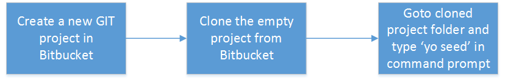

Seed
====
Seed is a scaffolding project created to generate new micro services tailered to Jetblue Micro Service requirements. The generated project will have much of the boilerplate code required for the service.  Thus the developer does not have to worry about creating them anymore.

## Git Source
https://bitbucket.it.jetblue.com/scm/jbap/generator-seed.git

## Getting Started
Project Generator provides you a quick start-up service with default packages and dependencies generated based on project service standards. Follow the steps below to setup project generator.

### Installation
- Node.js installed. Click [here](https://nodejs.org/en/) for instructions to install Node.js  
- Yoeman installed. Click [here](http://yeoman.io/learning/) for instructions to install Yeoman

Use curl to execute the below command. Click [here](https://curl.haxx.se/download.html) to download curl for windows

### Download Latest Seed from Artifactory
Before scaffolding a new project, ensure that you have the latest Seed in your local machine.  You can easily update your local copy by downloading Seed from artifactory.

In order to successfully download the latest Seed do the following:

#### Step1 - Configuring .npmrc
- Open .npmrc file (in Windows %USERPROFILE%/.npmrc) in notepad.exe
- Enter the following:
```
_auth = <USERNAME>:<PASSWORD> (converted to base 64)
email = youremail@email.com
always-auth = true
npm config set registry https://artifactory.it.jetblue.com/artifactory/api/npm/nodejs-virtual/
``` 
#### Step2 - Download Seed from Artifactory
Enter the following command in your command prompt:

``` > npm -g install generator-seed ```


### Publish Seed
In order to publish the generator to the artifactory, ensure you have publish privilege. Please contact DevOps if you dont have the permission.
Following need to be taken care before publishing:
- Update the version in package.json
- Ensure the Readme.md file is updated with history of changes made

Peform the following command in your command prompt to publish the changes made in Seed Generator:
``` > npm publish ```

### Generate A New Service


Follow the steps below to create a new service using Seed.  The above diagram also illustrates the same:
- Create a new project in Bitbucket
- Clone the project in local directory
- Open the cloned project in command prompt and run the command
``` > yo seed ```
- Follow the instructions on your command prompt to generate the new project

Seed expectes the project folder to follow certain conventions such as:
- The project name should be in lower case
- The project name should end with -service
- The project folder should be empty 

### Updating the generator code
To update the generator code, pull the latest from bitbucket - https://bitbucket.it.jetblue.com/projects/JBAP/repos/generator-seed/browse
To test the changes locally, go to the project folder in the cmd prompt and enter:
``` > npm link ```
To publish the changes to artifactory, first ensure that the version in package.json is updated.  Enter the following in cmd prompt to publish to artifactory
``` > npm publish ```

### Release Notes
##### 1.0.6
- ContextPath is fixed to support configuration in pillar
- jar naming convention is fixed.
-- Updated build.gradle to include sonar-project.properties
-- Updated build.gradle to include artifactory 
-- Updated gradle.properties to include credentials for artifactory
##### 1.0.5
- Modified Acutator implementation to support spring-boot 2.0.2
- server.contextPath is changed to server.servlet.path as required by Spring 2
- Added property in application.properties to enable actuator endpoints - health, ready, env
-- Swagger dependency for Swagger2 fixed
##### 1.0.4
- Upgraded spring-boot dependency to 2.0.2 RELEASE
- Upgraded gradle-wrapper dependency to 4.2.1
- Upgraded swagger dependency to swagger2-2.8.0


